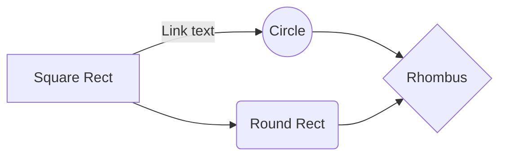

# Contenido de la página de inicio

"¡Bienvenido a la aplicación!"

## Aquí puedes encontrar un resumen de las funcionalidades disponibles:")

- **Indicadores Económicos**: Consulta los últimos indicadores económicos.

- **Ventas**: Revisa las ventas realizadas.

- **Abonados**: Consulta los documentos tributarios electrónicos.

- **Depósitos**: Revisa los depósitos realizados.

- **Ventas Totales**: Consulta el total de ventas.

- **ETL**: Realiza procesos de extracción, transformación y carga de datos.

- **Prueba 1** : este es un ejemplo